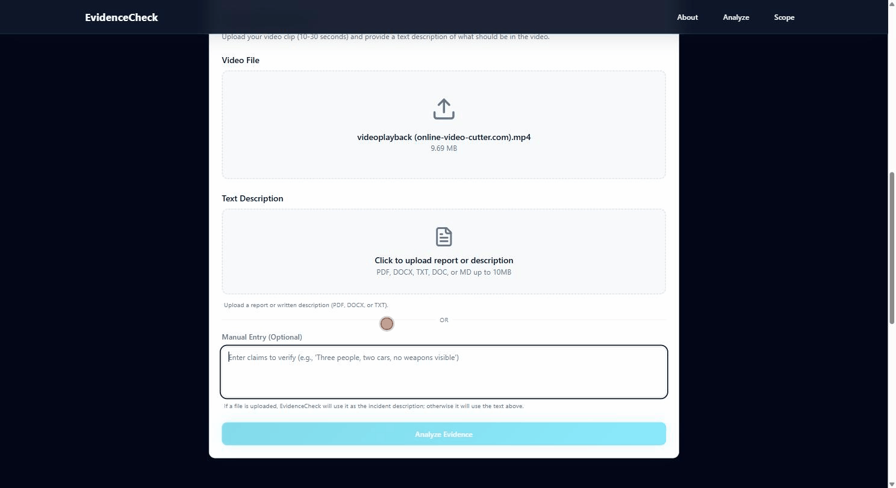
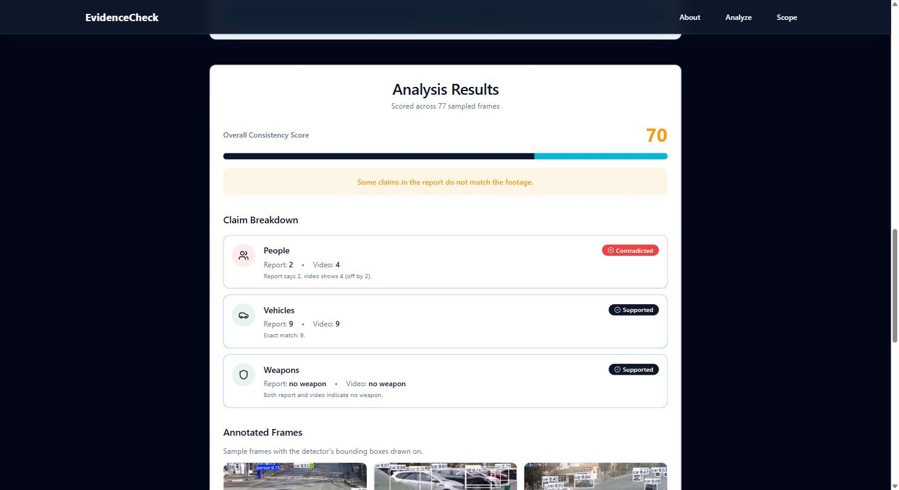

# EvidenceCheck

**Checks whether a written incident report matches the video it describes.** Insurance claims
arrive as free text, and when dashcam or CCTV footage exists someone has to watch it and confirm
the two agree — EvidenceCheck automates the countable part of that first pass and scores the
agreement from 0 to 100.



Upload a clip and its report. The API samples frames, runs YOLOv8 over each one, extracts the
claims the report makes about people, vehicles, and weapons, and returns a per-claim breakdown
showing exactly where the two disagree.



> No hosted demo — the detector needs PyTorch and a couple of gigabytes of RAM, which is more
> than the free tiers comfortably give. The setup below runs the whole thing locally in about
> two commands.

---

## Tech stack

| Layer | Built with |
|---|---|
| **API** | Python 3.10–3.13, FastAPI, Uvicorn, Pydantic |
| **Vision** | Ultralytics YOLOv8 (COCO-pretrained), OpenCV |
| **Web** | React 18, TypeScript, Vite, Tailwind CSS, shadcn/ui |
| **Testing** | pytest, Vitest |
| **Tooling** | Ruff, ESLint, Prettier, Docker Compose, GitHub Actions |

---

## Quick start

### Docker

```bash
git clone https://github.com/a-nathan-na/EvidenceCheck.git
cd EvidenceCheck
docker compose up --build
```

Then open <http://localhost:3000>. The first build takes 5–10 minutes, mostly PyTorch; the
model weights are baked into the image, so the first request does not stall on a download.

### Running it directly

Two terminals. **Python 3.10–3.13** — Ultralytics pulls PyTorch, which has no wheels for 3.14.

```bash
# Terminal 1 — API on :8000
cd backend
python -m venv .venv
source .venv/bin/activate        # Windows: .venv\Scripts\Activate.ps1
pip install -e ".[vision]"
uvicorn app.main:app --reload
```

```bash
# Terminal 2 — web app on :5173
cd frontend
npm install
npm run dev
```

Open <http://localhost:5173>. YOLOv8 downloads its weights (~6 MB) on the first analysis.

Sample report forms live in `data/`; supply your own clip — a 10–30 second daylight scene with
people and vehicles in frame works best. Interactive API docs are at
<http://localhost:8000/docs>, and every setting is documented in `backend/.env.example`.

---

## How it works

```
video ──▶ sample 1 fps ──▶ YOLOv8 per frame ──▶ max count per class ──┐
                                                                     ├──▶ score 0–100
report ─▶ regex claim extraction ─▶ {people, cars, weapon_present} ───┘
```

**Detection.** Frames are sampled once per second and each class is reported as the highest
count seen in any *single* frame. Taking the max rather than a sum avoids counting the same
person once per frame.

**Parsing.** `backend/app/claims.py` pulls counts written as digits or words, singular
phrasings, and weapon presence including negations. It imports nothing outside the standard
library, which is what lets the test suite run without PyTorch.

**Scoring.** Every claim starts at 100 and loses points for disagreement:

| Disagreement | Penalty | Result |
|---|---|---|
| Count matches exactly | 0 | `supported` |
| Count off by one | −10 | `partial` |
| Count off by more | −30 | `contradicted` |
| Weapon presence mismatch | −40 | `contradicted` |
| Report never made the claim | 0 | `not_applicable` |

A claim the report never made is skipped, not counted as agreement.

---

## Tests

```bash
cd backend && pytest          # 51 tests, ~0.5s
cd frontend && npm test       # 6 tests
```

The backend suite covers claim parsing, scoring, and every endpoint. `analyze_video` is
monkeypatched throughout, and `app/video.py` imports OpenCV and Ultralytics lazily, so
`pip install -e ".[dev]"` is enough to run everything — no model download, no PyTorch, no
GPU. CI installs exactly that and finishes in seconds.

Also available: `ruff check .` and `ruff format --check .` in `backend/`; `npm run lint`,
`npm run format:check`, and `npm run typecheck` in `frontend/`.

---

## Limitations

These are real and worth knowing before you judge a score.

- **Guns are not detectable.** COCO has no firearm class. Class 76 is `knife`, and that is the
  only weapon-like object a stock YOLOv8 model can report. The weapon check demonstrates the
  scoring mechanism; it is not a usable weapon detector.
- **The detector counts everything in frame, the report usually does not.** Running `data/clip1`
  against real footage scored 70: the report describes the two vehicles in the collision, while
  the detector counted nine, because it also sees traffic in the background. Distinguishing
  involved parties from bystanders is not something object detection alone can do.
- **Max-per-frame undercounts.** People who are never on screen simultaneously are counted as
  fewer than there were.
- **Parsing is regex, not NLP.** "A red sedan" is missed because the article is not adjacent to
  the noun; "several pedestrians" yields no count at all.
- **Daylight, fixed camera, static counts.** No night footage, no audio, no actions or
  timelines, no multi-camera, and no way to tell one role from another.

---

## Project structure

```
backend/
  app/
    main.py       FastAPI routes
    claims.py     report parsing — standard library only
    scoring.py    consistency scoring
    video.py      YOLOv8 detection, heavy imports deferred
    config.py     environment-driven settings
    schemas.py    pydantic request/response models
  tests/          pytest suite
frontend/
  src/
    lib/api.ts    typed API client + response transform
    components/   UploadSection, ResultsSection, shadcn/ui primitives
    pages/        Index, NotFound
data/             sample incident report forms
docs/             API reference and screenshots
```

---

## What I would do next

- Track objects across frames instead of taking a per-frame maximum, so counts survive people
  walking in and out of shot.
- Replace the regex parser with a small model or a grammar, mainly to handle non-adjacent
  articles and vague quantifiers.
- Let the report scope a claim to the parties involved rather than everything visible — the
  single biggest source of false disagreements today.
- Stream progress over WebSocket; a 30-second analysis currently sits behind one long POST.

---

## API

See [docs/api.md](docs/api.md).

## Author

Built by [Nathan Aye](https://www.linkedin.com/in/nathan-aye-328450334/).
